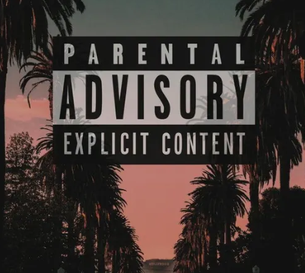

# My First Git Project

## 📌 Төслийн танилцуулга
Энэ бол Markdown туршилтын лабораторийн ажил.

## 🎯 Зорилго
- Git ашиглах
- Markdown бичих
- README файл үүсгэх

## 🛠 Ашигласан командууд

### ✔ Inline code
`git status`

### ✔ Code block
```bash
git add .
git commit -m "first commit"
```

## 🔗 Link хийх
[ДаТС вэб сайт руу шилжих](https://stda.edu.mn/)

## 🖼 Зураг оруулах



## 📊 Хүснэгт

|Нэр	|Нас	|Мэргэжил|
|-------|-------|--------|
|Бат	|20	    |IT      |
|Болд   |22	    |SE      |